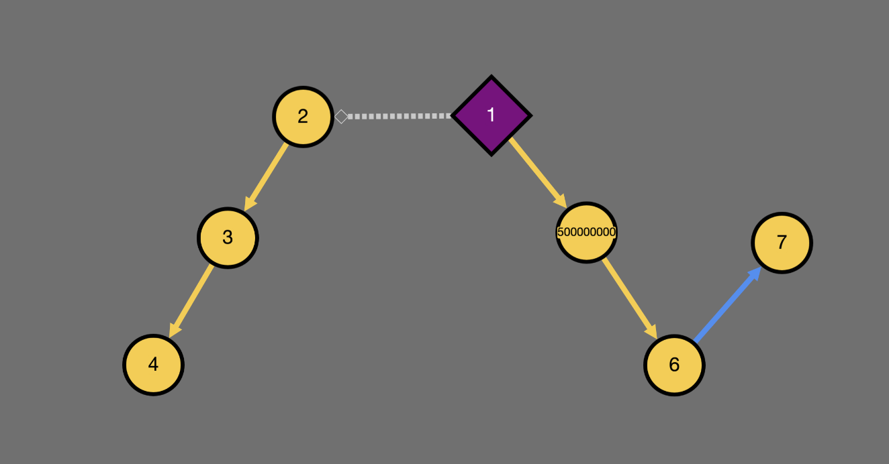
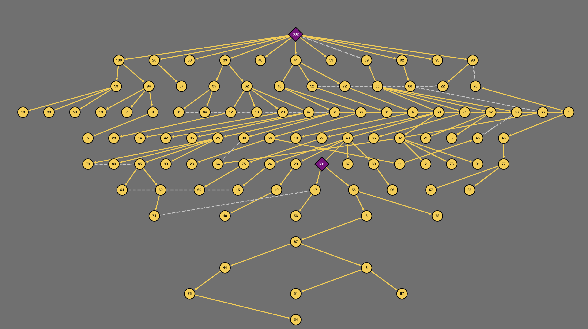
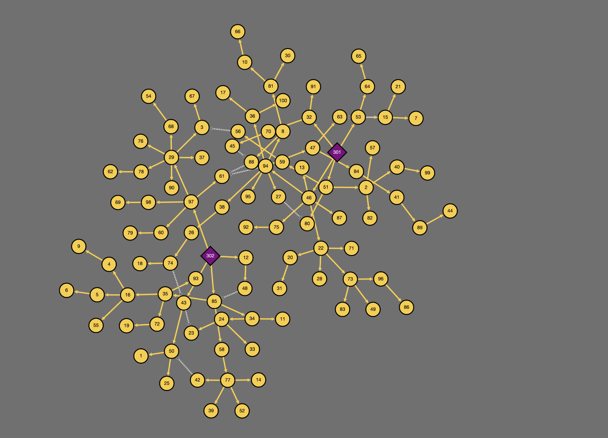

<!--
SPDX-FileCopyrightText: Contributors to the Power Grid Model project <powergridmodel@lfenergy.org>

SPDX-License-Identifier: MPL-2.0
-->

# Visualizer

## Features

- Based on [dash-cytoscape](https://github.com/plotly/dash-cytoscape).
- Visualize small and large (10000+ nodes) networks
- Explore attributes of nodes and branches
- Highlight specific nodes and branches
- Visualize various layouts, including hierarchical, force-directed and coordinate-based layouts
- Visualize attributes over a heatmap

With Coordinates    | Hierarchical | Force-Directed
:------------------:|:------------:|:-------------:
 |       |   

-----

## Quickstart

#### Installation

```bash
pip install 'power-grid-model-ds[visualizer]'  # quotes added for zsh compatibility
```

#### Usage

```python
from power_grid_model_ds import Grid
from power_grid_model_ds.visualizer import visualize
from power_grid_model_ds.generators import RadialGridGenerator

grid = RadialGridGenerator(Grid).run()
visualize(grid)
```

This will start a local web server at <http://localhost:8050>

##### Tabulate element data

Clicking on a node or branch will show the data of all elements associated with it in the table below. For example, clicking on a node will show the data of node along with all sensors, loads, generators, etc. that are connected to that node. Clicking on a branch will show the branch data and all sensors, regulators, etc. that are connected to that branch.

##### Search

Search based on attribtues of any components. The associated elements will be highlighted in the graph. See [Examples](#examples) below for some handy search queries.

##### Scenario exploration

Changing the scenario from `Config` menu will update the visualizer with the new data. This allows you to easily explore different scenarios and compare them visually.

##### Layouts

The visualizer supports multiple layouts, including hierarchical, force-directed and coordinate-based layouts. You can switch between these layouts from `Config` menu to find the one that best suits your needs. The coordinate-based layout will use the coordinates provided in the `grid.node.x` and `grid.node.y` attributes, while the hierarchical and force-directed layouts will automatically arrange the nodes based on their connections.

##### Heatmap

The heatmap allows you to visualize the values of a particular attribute across the network. For example, you can visualize the voltage levels at each node or the loading of each branch. The color intensity will indicate the value of the attribute, with a legend provided for reference.

##### Plotting across scenarios

The visualizer also allows you to plot the values of a particular attribute across different scenarios. This can be useful for comparing the results of different scenarios and identifying trends or patterns. For example timeseries variation of voltage results of a calculation. To plot any attribute for a component, click on any cell on the table obtained from [Tabulate associated elements](#tabulate-associated-elements) and click on any attribute. If there is batch data available for it in update_data or output_data, then it should be plotted below the table.

#### Examples

The visualizer has a minimal design at the moment.
Hence not all possibilities are directly mentioned in the UI. This section provides some handy tips to visualize common situations:

- All elements of a particular component type: Search -> Desired Component -> any attribute -> unassgined value (eg. Search -> `sym_power_sensor` -> `id` ->  `!=` ->  `-1`)
- All in-edges/out-edges for a particular node: Search -> `branches` -> `from_node` or `to_node` -> desired node.
- Voltage levels: Heatmap -> `node` -> `u_rated`
- Heatmap any result when an extended grid with result attribute is provided can be visualized.
  - Heatmap -> `node` -> `u_pu`
  - Heatmap -> `line` -> `loading`
  - Heatmap -> `node` -> `energized`

#### Disclaimer

Please note that the visualizer is still a work in progress and may not be fully functional or contain bugs.
We welcome any feedback or suggestions for improvement.
